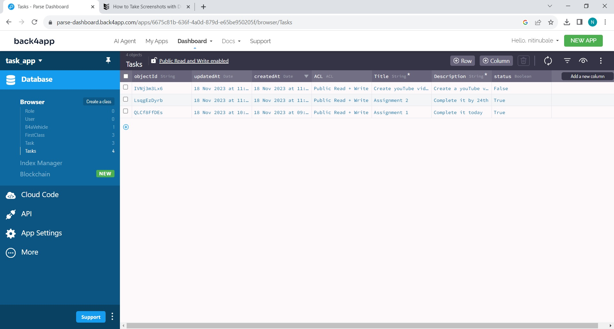
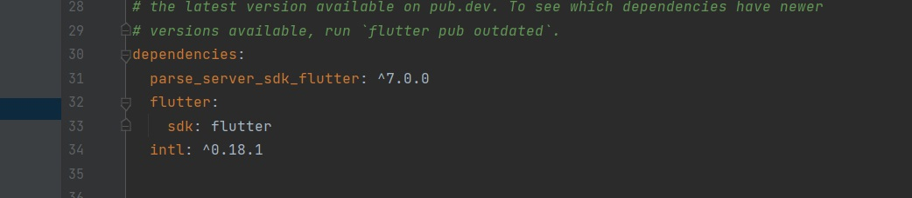
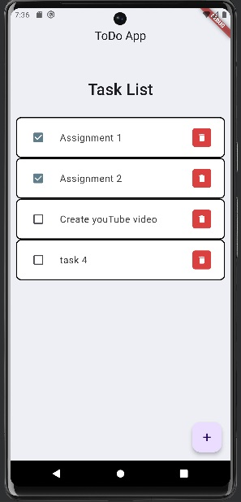
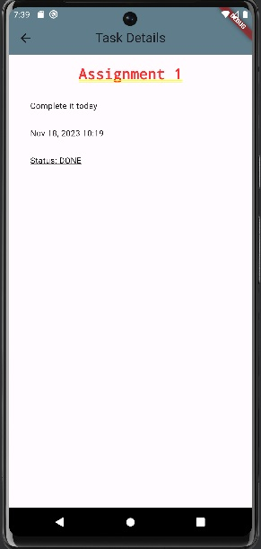
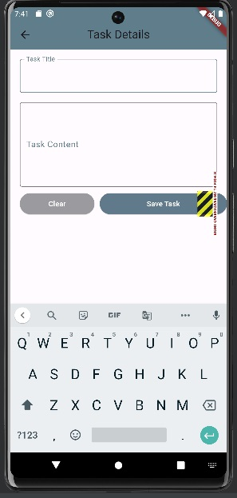

# Assignment Title - Flutter App with Back4App Integration

Create a flutter app that cnnects to Back4App, a Backend-as-a-service (BAAS)
platform to manage tasks

## Getting Started
# Step 1 - Setup Back4App

1. Sign up a Back4App account
1. Create a class names Tasks with columns
    - Title
   - Description
   - Status

>Back4App Dashboard

# Step 2

- Create a new flutter project - cpad_assignmnt_task_app
- Add required dependencies to the pubspec.yaml.file

# Application Details

The tasks application is made of 3 pages
- Home Page
- Task Detail page
- Create new task page

Tasks are saved in Back4App and are fetched from the same

>Home Page

Home Page consists of list of tasks, checkboxes on each task to check when complete
Every task has a delete button to delete any tasks from the database

>Task Detail Page

On clicking on any individual task, we are directed to the details page which includes the title, detailed decription, creation date and the status of the task

> New Task page

On this page, user is able to create tasks which get saved to the database. By default the status is false.

